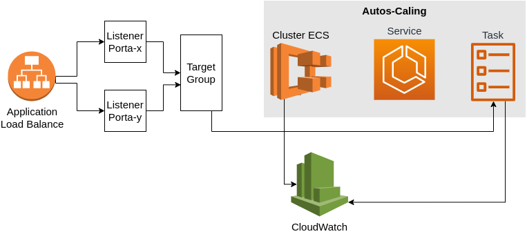

## Infraestrutura
Imagem da infraestrutura do cluster ECS.


## Requirements

| Name | Version |
|------|---------|
| <a name="requirement_terraform"></a> [terraform](#requirement\_terraform) | >= 1.0.0 |
| <a name="aws"></a> [aws](#requirement\aws) | ~> 4.0 |

## Providers

| Name | Version |
|------|---------|
| <a name="provider_aws"></a> [aws](#aws\_aws) | 4.0 |

## Modules

Este modulo permite provisionar cluster ECS.

### O que será criado?
- Cluster ECS.
- Service.
- Task definition.
- Politicas de AutoScaling
- Security Group.
- Load Balance.

### O que é o Amazon ECS?
O Amazon Elastic Container Service (ou ECS, para abreviar) é um serviço totalmente gerenciado de orquestração de contêineres que ajuda a implantar, gerenciar e escalar facilmente aplicações em contêineres.

> Para saber mais sobre AWS ECS acesso o link: https://docs.aws.amazon.com/ecs/index.html 

## Recursos utilizados nesse projeto:

| Name | Type | Description |
|------|------|---------- |
| [aws_ecs_cluster](https://registry.terraform.io/providers/hashicorp/aws/latest/docs/resources/ecs_cluster) | resource | Cria um cluster para executar os containers.  |
| [aws_ecs_service](https://registry.terraform.io/providers/hashicorp/aws/latest/docs/resources/ecs_service) | resource | Permite executar e manter número especificado de tasks definitions em execução no cluster.  |
| [aws_ecs_task_definition](https://registry.terraform.io/providers/hashicorp/aws/latest/docs/resources/ecs_task_definition) | resource | É um arquivo de texto em formato JSON que descreve uma ou mais características dos contêineres. |
| [aws_appautoscaling_target](https://registry.terraform.io/providers/hashicorp/aws/latest/docs/resources/appautoscaling_target) | resource | O Auto Scaling é um serviço que permite aumentar ou diminuir a escala das tarefas (tasks). |
| [aws_appautoscaling_policy](https://registry.terraform.io/providers/hashicorp/aws/latest/docs/resources/appautoscaling_policy) | resource | O Auto Scaling policy define as regras de escala de um serviço Auto Scaling. |
| [aws_iam_role](https://registry.terraform.io/providers/hashicorp/aws/latest/docs/resources/iam_role) | resource | IAM é um serviço de gerenciamento de acesso que ajuda você a controlar o acesso aos recursos da AWS. |
| [aws_iam_role_policy_attachment](https://registry.terraform.io/providers/hashicorp/aws/latest/docs/resources/iam_policy_attachment) | resource | IAM é um serviço de gerenciamento de acesso que ajuda você a controlar o acesso aos recursos da AWS. |
| [aws_lb](https://registry.terraform.io/providers/hashicorp/aws/latest/docs/resources/lb) | resource | Elastic Load Balance distribui automaticamente o tráfego de entrada entre as tarefas (tasks) do serviço no cluster. |
| [aws_lb_target_group](https://registry.terraform.io/providers/hashicorp/aws/latest/docs/resources/lb_target_group) | resource | Fornece um grupo de destino que onde o load balance consiga encaminhar requisições. |
| [aws_lb_listener](https://registry.terraform.io/providers/hashicorp/aws/latest/docs/resources/lb_listener) | resource | Porta onde o balanceador de carga está escutando as requisições. |
| [aws_security_group](https://registry.terraform.io/providers/hashicorp/aws/latest/docs/resources/elasticache_security_group) | resource |  Grupo de segurança atua como um firewall virtual. |
| [aws_cloudwatch_log_group](https://registry.terraform.io/providers/hashicorp/aws/latest/docs/resources/cloudwatch_log_group) | resource | CloudWatch responsável por armazenar os logs das task. |
| [required_providers](https://www.terraform.io/language/expressions/version-constraints) | expression | Sintaxe do Terraform para restrições de versão. |
| [provider](https://www.terraform.io/language/providers) | provider | São plugins utilizado pelo Terraform para interagir com provedores de nuvem.
| [locals](https://www.terraform.io/language/values/locals) | input | Um conjunto de valores relacionados `chave=valor` que podem ser declarados em um único bloco. |
| [variables](https://www.terraform.io/language/values/variables) | input | Serve como parâmetros para que um usuário possam personalizar o comportamento sem editar o código fonte. |

## Inputs

| Name | Description | Type | Default | Required |
|------|-------------|------|---------|:--------:|
| create\_cluster | Define se cluster será criado | `bool` | true | no |
| cluster\_name | Nome do cluster ECS | `string` | n/a | yes |
| container\_insights | Usado para habilitar CloudWatch Container Insights para o cluster | `bool` | true | no |
| delete\_protection | Impede que terraform exclua o load balance | `bool` | false | no |
| region | Região AWS | `string` | n/a | yes |
| service\_name | Nome do service cluster que será criado | `string` | n/a | yes |
| tags | Tags para recurso | `map(string)` | n/a | yes |
| service\_name | Nome do service cluster que será criado | `string` | n/a | yes |
| app\_count | Números de tarefas em execução task definition | `number` | n/a | yes |
| family\_name | Nome para task definition | `string` | n/a | yes |
| fargate\_cpu | Número de CPUs usados na task definition | `number` | n/a | yes |
| fargate\_memory | Quantidade de memória usada pela task definition | `number` | n/a | yes |
| subnet\_ids | ID das subnetes | `list(string)` | n/a | yes |
| vpc\_id | ID da VPC | `string` | n/a | yes |
| app\_port | Porta que será utilizada pela aplicação | `number` | n/a | yes |
| protocol | Protocolo que será utilizado na aplicação `<http, https, tcp>` | `string` | n/a | yes |
| policy\_ssl | Nome da política SSL. Obrigatório se o protocolo for `HTTPS ou TLS` | `string` | null | no |
| certificate\_arn | ARN do certificado de servidor SSL padrão | `string` | null | no |
| template\_container | Um arquivo json que contém as definições do container | `list(object)` | n/a | no |
| tags | Tag para recursos criados | `map(string)` | n/a | yes |


## Outputs

| Name | Description |
|------|-------------|
| loadbalance_dns_name | Endereço DNS do loadbalance |

## Como usar esse módulo
[Acesse o passo-a-passo](how-to-use-this-module/README.md)

---
# Utilizando o módulo

### Pré-Requisitos

| Name | Version |
|------|---------|
| [terraform](#requirement\_terraform) | >= 1.0.0 |

### Criar `terrafile.tf`
Crie um arquivo `terraform.tf` com o seguinte conteúdo. E altere os valores das variáveis. 

```hcl
module "ecs_mentoria" {
  source          = "git@github.com:mentoriaiac/iac-modulo-aws-ecs.git?ref=v1.0"
  cria_cluster    = true
  app_port        = 80
  region          = "us-east-1"
  app_count       = 1
  fargate_cpu     = 256
  fargate_memory  = 512
  subnet_ids      = ["<ID_SUBNET_X>", "<ID_SUBNET_Y>"]
  vpc_id          = "<ID_AWS_VPC>"
  protocol        = "HTTP"
  family_name     = "<NAME>"
  service_name    = "<NAME>"
  cluster_name    = "<NAME>"
  template_container = [{
    name      = "<NAME>"
    image     = "<ENDEREÇO_REGISTRER_IMAGEM_DOCKER>"
    cpu       = 128
    memory    = 256
    essential = true
    portMappings = [{
      containerPort = 80
      hostPort      = 80
    }]
    logConfiguration = {
      logDriver = "awslogs"
      options = {
        awslogs-group         = "<NAME>"
        awslogs-region        = "us-east-1"
        awslogs-stream-prefix = "<NAME>"

      }
    }
  }]
}

output "load_balancer_dns_name" {
  value = "http://${module.ecs_mentoria.loadbalance_dns_name}"
}

```

### Provisionando Cluster ECS
Após preencher os valores requiridos utilize os comandos abaixo para provisonar cluster e suas aplicação.

```shell
terraform init 
terraform fmt
terraform validate
terraform plan
terraform apply
```

### Descrição dos comandos:
Segue uma breve descrição dos comandos listados acima. 
>**terraform init**: Execute o terraform init para baixar todos os plugins necessários.

>**terraform fmt**: O comando é usado para reescrever os arquivos de configuração do Terraform para um formato e estilo canônicos.

>**terraform validate**: Comando valida sintaticamente os arquivos de configuração em um diretório.

>**terraform plan**: Executar um plano de terraform e colocá-lo em um arquivo chamado plano.

>**terraform apply**: Usa plano para aplicar as alterações na AWS.
